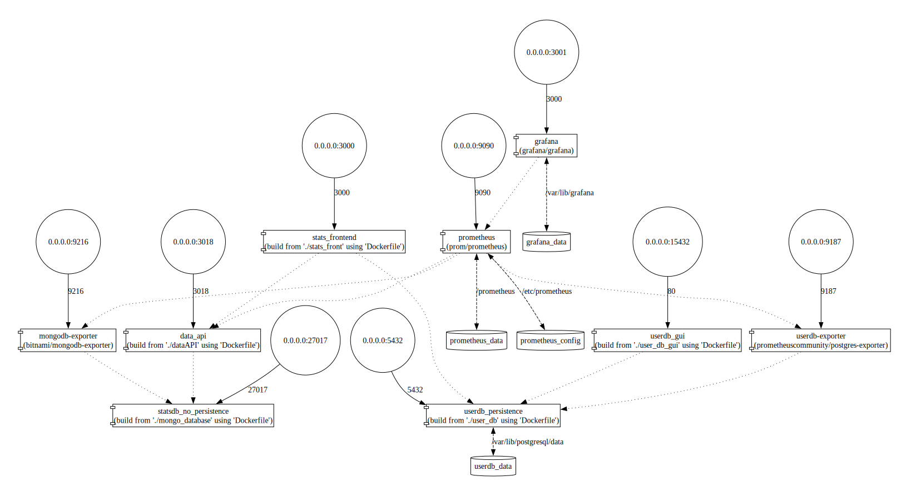

# Socioeconomic Statistics Service

An interactive web application for exploring, visualizing, and analyzing a wide range of socioeconomic statistics. The platform empowers users to gain insights from data through dynamic charts, responsive UI, and flexible data querying.



## Features

- **Interactive Data Visualizations:** Explore trends and patterns with dynamic charts powered by Chart.js.
- **Data Filtering:** Focus on specific regions, years, or categories to refine your analysis.
- **Custom API Builder:** Generate and export custom data queries for more advanced needs.
- **Responsive Design:** Seamless experience on both desktop and mobile devices.
- **User-Friendly Interface:** Intuitive navigation for users of all backgrounds.


## Getting Started

### Prerequisites

- Docker

### Installation

Clone the repository and install dependencies:
```bash
git clone https://github.com/PenguinPops/Socioeconomic-Statistics-Service.git
cd Socioeconomic-Statistics-Service/db_api/
```

## Running Locally

Start the development server:
```bash

docker-compose up

```
Then open http://localhost:3000 in your browser.
The API is at http://localhost:3018.
The pgAdmin is at http://localhost:15432.

## Technologies Used

- JavaScript / TypeScript
- Chart.js
- Node.js
- (Add frameworks/libraries used, e.g., React, Express, etc.)
- Docker (for containerization)
- Shell scripts (for deployment/automation)

## Project Structure

```text
├── archive                            # Source code archive for mongoDB
│   ├── database
│   └── docker_mongoDB
└── db_api                             # Main source code
    ├── compose-viz.VizFormats.svg       # System overview
    ├── dataAPI                          # Express API
    ├── docker-compose.yml               # Docker Compose file
    ├── mongo_database                   # MongoDB setup
    ├── prometheus                       # Prometheus (WIP)
    ├── stats_front                      # Frontend in Next.js
    ├── user_db                          # Postgres user database
    └── user_db_gui                      # pgAdmin
```


## Contributing

Contributions are welcome!

## License

This project is licensed under the MIT License.

## Contact

For questions, suggestions, or support:

- Open an issue
- Contact PenguinPops
